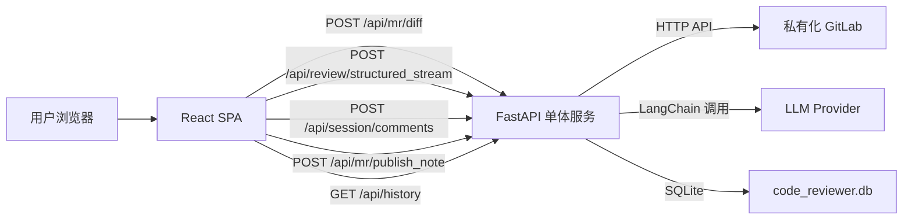
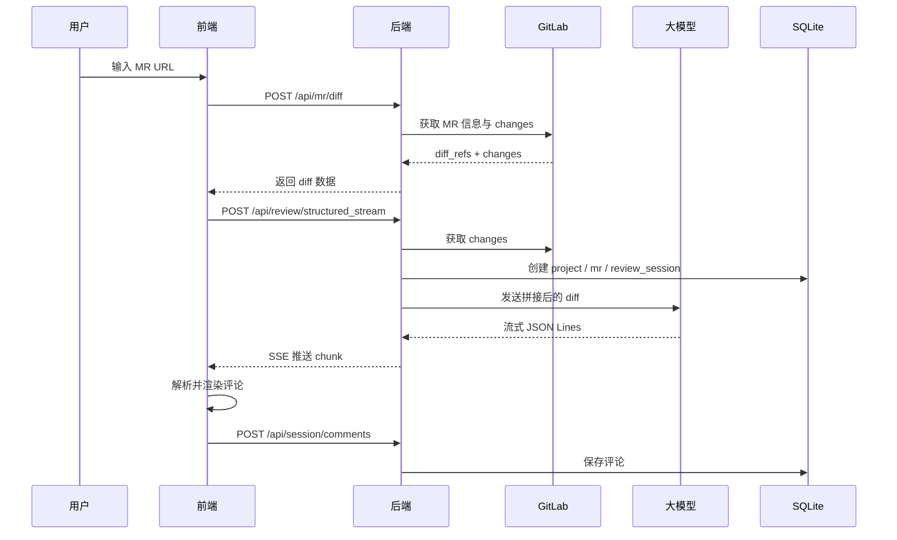

# AI Code Reviewer 技术分析与架构优化方案

## 1. 文档说明

本文档完全基于当前仓库源码分析得出，刻意不依赖 `README.md`、`CLAUDE.md`、`AGENTS.md` 等可能过期的说明文件。

分析范围：

- 前端：`frontend/`
- 后端：`backend/`
- 数据层：`backend/schema.sql`、`backend/database.py`
- 运行与工程化：`package.json`、`package-lock.json`、`requirements.txt`、Vite/Tailwind/Eslint 配置

当前仓库可以概括为：

- 一个单仓的前后端分离项目
- 前端是 React + Vite 的单页应用
- 后端是 FastAPI + LangChain 的单体服务
- 数据持久化使用 SQLite
- 业务目标是对私有化 GitLab Merge Request 执行 LLM 代码审查，并支持把建议回评到 GitLab

---

## 2. 源码级结论摘要

### 2.1 项目当前真实定位

当前实现不是一个“完整自动回评平台”，而是一个**单体式 AI MR 审查工作台**，核心链路已经可见，但仍处于“功能可演示、架构未收敛”的阶段。

项目同时存在两代实现：

- 旧链路：把整个 diff 交给大模型，生成一段完整 Markdown 报告，再作为 MR 普通 note 回评
- 新链路：把 diff 交给大模型，要求输出 JSON Lines 形式的逐条问题，再让用户在前端逐条确认并发布为 GitLab 行内评论

前端当前实际使用的是新链路，旧链路仍然残留在后端 API 中。

### 2.2 当前代码最重要的事实

- 前端主页面逻辑高度集中在 [`frontend/src/App.jsx`](C:\Users\YFDYF\.codex\worktrees\a8b1\ai-code-reviewer\frontend\src\App.jsx) 一个超大组件中
- 差异渲染与评论发布逻辑集中在 [`frontend/src/DiffViewer.jsx`](C:\Users\YFDYF\.codex\worktrees\a8b1\ai-code-reviewer\frontend\src\DiffViewer.jsx)
- 后端所有 API 和业务编排集中在 [`backend/main.py`](C:\Users\YFDYF\.codex\worktrees\a8b1\ai-code-reviewer\backend\main.py)
- LLM 适配逻辑集中在 [`backend/reviewer.py`](C:\Users\YFDYF\.codex\worktrees\a8b1\ai-code-reviewer\backend\reviewer.py)
- SQLite Repository 模式集中在 [`backend/database.py`](C:\Users\YFDYF\.codex\worktrees\a8b1\ai-code-reviewer\backend\database.py)
- 数据表结构清晰，但业务实现没有完全把 schema 设计用起来
- 当前没有测试、没有容器化文件、没有 CI 配置、没有认证授权层
- 当前前端依赖锁文件与 `package.json` 已失配，工程不可复现

### 2.3 当前版本最关键的问题

1. 安全面风险很高
2. 前端工程状态不稳定
3. 评论持久化与发布状态链路不闭环
4. 后端存在旧新两套逻辑并行，职责混杂
5. 大模型审查链路对大 MR、异常输出、并发和可观测性支持不足

---

## 3. 代码结构总览

## 3.1 目录结构

```text
ai-code-reviewer/
├─ backend/
│  ├─ main.py
│  ├─ reviewer.py
│  ├─ database.py
│  ├─ models.py
│  ├─ migration.py
│  ├─ schema.sql
│  ├─ requirements.txt
│  └─ config.example.toml
├─ frontend/
│  ├─ package.json
│  ├─ package-lock.json
│  ├─ vite.config.js
│  ├─ tailwind.config.js
│  ├─ eslint.config.js
│  ├─ index.html
│  ├─ postcss.config.js
│  ├─ public/
│  └─ src/
│     ├─ main.jsx
│     ├─ App.jsx
│     ├─ DiffViewer.jsx
│     ├─ index.css
│     └─ App.css
└─ docs/
   └─ technical-analysis.md
```

## 3.2 代码规模

后端主要文件：

- `main.py`: 576 行
- `database.py`: 470 行
- `models.py`: 199 行
- `migration.py`: 178 行
- `reviewer.py`: 169 行

前端主要文件：

- `App.jsx`: 1167 行
- `DiffViewer.jsx`: 206 行
- `App.css`: 146 行
- `index.css`: 15 行

结论：

- 后端是“单文件集中编排 + 仓储层”的结构
- 前端是“超大容器组件 + 单个 diff 组件”的结构
- 当前没有形成清晰的模块边界

---

## 4. 技术栈识别

## 4.1 前端

从 [`frontend/package.json`](C:\Users\YFDYF\.codex\worktrees\a8b1\ai-code-reviewer\frontend\package.json) 可识别：

- React 19
- Vite 5
- Axios
- parse-diff
- react-markdown
- remark-gfm
- lucide-react
- Tailwind CSS 3
- ESLint 9

实际使用上：

- `axios` 用于普通 REST 请求
- `fetch` 用于 `SSE + ReadableStream` 流式读取
- `parse-diff` 用于解析 Git diff
- `react-markdown`、`remark-gfm` 已安装但当前前端未实际使用

## 4.2 后端

从 [`backend/requirements.txt`](C:\Users\YFDYF\.codex\worktrees\a8b1\ai-code-reviewer\backend\requirements.txt) 和源码可识别：

- FastAPI
- Uvicorn
- LangChain
- langchain-openai
- langchain-anthropic
- langchain-google-genai
- httpx
- toml
- SQLite 标准库

实际使用上：

- FastAPI 提供 REST + SSE
- LangChain 负责统一 LLM 调用
- httpx 调 GitLab API
- SQLite 持久化配置、会话、评论、历史记录

需要注意：

- `langchain-google-genai` 已声明依赖，但当前 `get_llm()` 并未真正支持 Gemini 路由
- `config.example.toml` 中仍保留 `gemini`、`zhipu`、`claude`、`custom_openai` 等旧结构痕迹，和当前运行代码并不一致

---

## 5. 核心业务目标与真实能力边界

## 5.1 已实现能力

当前源码已经实现的真实能力如下：

1. 用户在前端输入一个或多个 GitLab MR URL
2. 前端解析 URL，支持单 MR 和批量 MR 模式
3. 后端根据 MR URL 拉取 GitLab diff 数据
4. 后端把 diff 拼接成文本交给 LLM
5. LLM 以流式方式输出结构化 JSON Lines 评论
6. 前端边接收边渲染评论，并把评论定位到 diff 行
7. 用户可以在前端逐条编辑评论文本
8. 用户可以把某条评论发布到 GitLab 行内讨论
9. 后端会把会话、MR、评论信息持久化到 SQLite
10. 前端可查看历史会话和评论列表

## 5.2 未真正闭环的能力

以下能力看似存在，但实际未完整闭环：

1. 评论发布状态同步到数据库
2. 历史记录中的评论再发布
3. 完整审查报告落库
4. Prompt 与 Provider 体系的统一抽象
5. 工程可重复构建
6. 认证、权限与密钥保护

---

## 6. 整体架构



### 架构特征

- 部署形态上是前后端分离
- 仓库形态上是单仓
- 运行时后端仍是单体服务
- 没有任务队列、没有异步 worker、没有缓存层、没有权限层

### 架构评价

这种结构适合：

- 内部工具
- 单团队使用
- 低并发
- 以人工确认为主的半自动审查

这种结构暂不适合：

- 多团队共享
- 高并发批量审查
- 企业级审计留痕
- 多租户
- 对稳定性和安全性要求高的生产环境

---

## 7. 前端架构分析

## 7.1 入口与渲染方式

入口文件是 [`frontend/src/main.jsx`](C:\Users\YFDYF\.codex\worktrees\a8b1\ai-code-reviewer\frontend\src\main.jsx)：

- 挂载 `App`
- 仅导入了 `index.css`

这意味着：

- [`frontend/src/App.css`](C:\Users\YFDYF\.codex\worktrees\a8b1\ai-code-reviewer\frontend\src\App.css) 中的自定义动画、Markdown 样式、滚动条样式当前**没有被引入**
- 代码中大量依赖的 `animate-fade-in-scale` 这类 class 实际不会生效

这是当前前端实现里的一个真实断层。

## 7.2 主组件职责

[`frontend/src/App.jsx`](C:\Users\YFDYF\.codex\worktrees\a8b1\ai-code-reviewer\frontend\src\App.jsx) 承担了几乎全部页面职责：

- 导航 tab 切换
- GitLab MR URL 解析
- 单 MR / 批量 MR 模式切换
- 审查触发
- SSE 流读取与解析
- 评论状态维护
- 配置读取与保存
- 历史记录列表与详情展示
- 全屏 diff 模式
- 浮动导航按钮

结论：

- 当前是一个“超级容器组件”
- 组件过大，状态过多，职责耦合明显
- 任何改动都容易触发回归

## 7.3 前端状态模型

主要状态可分为四组：

### 1. 审查输入态

- `mrUrlsText`
- `parsedMRs`
- `batchMode`

### 2. 审查执行态

- `mrData`
- `aiComments`
- `statusMessage`
- `isSubmitting`
- `currentSessionUuid`

### 3. 批量审查态

- `currentMRIndex`
- `batchResults`
- `reviewProgress`

### 4. 历史与设置态

- `historyList`
- `historyDetail`
- `config`
- `activeTab`

问题：

- `currentSessionUuid`、`batchResults`、`reviewProgress` 在当前实现中基本没有形成完整业务闭环
- 多套状态之间交叉写入，维护成本高

## 7.4 MR URL 解析

前端通过正则提取：

```text
https://gitlab.example.com/group/project/-/merge_requests/123
```

特点：

- 支持空格、换行、逗号混输
- 支持去重
- 支持自动进入批量模式

局限：

- 只支持标准 GitLab Web URL
- 不支持直接输入 `project_path + iid`
- 不支持 URL 参数、子路径变种的更强鲁棒性

## 7.5 流式审查交互

前端审查流程：

1. 先调用 `/api/mr/diff`
2. 再调用 `/api/review/structured_stream`
3. 使用 `ReadableStream` 逐块读取 SSE 响应
4. 解析 `data: {json}` 包裹的 SSE 消息
5. 对 `streaming.chunk` 再做一层 JSON Lines 解析
6. 将解析出的评论挂到对应文件与行号

优点：

- 用户能边生成边看到结果
- 交互体验优于等待整份报告完成

问题：

- SSE + JSON Lines 双层协议非常脆弱
- 对 LLM 非法输出没有严格容错
- 前端解析逻辑复杂且夹在视图组件里

## 7.6 Diff 展示组件

[`frontend/src/DiffViewer.jsx`](C:\Users\YFDYF\.codex\worktrees\a8b1\ai-code-reviewer\frontend\src\DiffViewer.jsx) 负责：

- 利用 `parse-diff` 解析变更
- 将 diff 拆成左右对照视图
- 在右侧挂载 AI 评论卡片
- 提供“忽略 / 删除”和“应用此建议”按钮

当前设计思路：

- 文件维度循环
- hunk 维度循环
- 行维度构造左右对照 rows
- 按 `new_path + new_line` 对评论做关联

优点：

- 结构直观
- 对新增/删除/上下文行都能基本对齐

问题：

- 评论只能稳定挂在“新文件行号”上
- 二进制 diff、复杂 rename、极端 patch 格式缺少兜底
- 组件同时承担解析、布局、交互、发布，耦合偏高

## 7.7 样式系统现状

当前样式来源有两份：

- `index.css`：只定义了 `.glass-panel`、`.apple-btn`、`.apple-input`
- `App.css`：定义了动画、滚动条、Markdown 样式等

但 `App.css` 未被导入，所以：

- 自定义动画类无效
- 自定义 Markdown 样式无效
- 滚动条美化无效

另外，代码里大量使用如下类名：

- `animate-in`
- `fade-in`
- `slide-in-from-bottom-4`
- `slide-in-from-top-2`
- `zoom-in`

这些类通常来自 `tailwindcss-animate`，但当前 `tailwind.config.js` 里并没有该插件，因此这部分动效大概率不会生效。

结论：

- 前端视觉层存在明显“代码已写但运行未接入”的漂移

## 7.8 前端工程现状

### 当前验证结果

- `npm run build` 失败
- `npm run lint` 失败
- 原因不是源码语法错误，而是本地没有安装依赖且锁文件失配

### 根因

`package.json` 与 `package-lock.json` 不同步：

- `package.json` 中 `vite` 是 `^5.4.19`
- `package-lock.json` 中锁定的是 `^8.0.1`
- `package.json` 中 `@vitejs/plugin-react` 是 `^4.3.4`
- `package-lock.json` 中锁定的是 `^6.0.1`

这意味着：

- 当前前端工程不可复现
- CI 或新机器安装依赖会失败
- 工程实际版本状态未知

---

## 8. 后端架构分析

## 8.1 总体形态

后端是一个单 FastAPI 进程，职责包含：

- 配置读取与保存
- GitLab MR 信息抓取
- LLM 调用
- SSE 输出
- 评论持久化
- 评论回评到 GitLab
- 历史记录查询

这种结构实现快，但职责重叠严重。

## 8.2 API 划分

当前 API 大致分为四类：

### 1. 配置类

- `GET /api/config`
- `POST /api/config`

### 2. 审查类

- `POST /api/review`
- `POST /api/review/stream`
- `POST /api/review/structured_stream`
- `POST /api/mr/diff`

### 3. 评论类

- `POST /api/mr/publish_note`
- `POST /api/session/comments`
- `POST /api/comments/{comment_id}/publish`

### 4. 历史类

- `GET /api/history`
- `GET /api/history/{session_uuid}`
- `GET /api/sessions/{session_uuid}/comments`

结论：

- 路由数量不多
- 但同一领域里存在“旧接口 + 新接口并存”
- 资源命名和业务命名还未统一

## 8.3 配置管理

配置真实来源已经是 SQLite，而不是 TOML。

读取链路：

- `reviewer.load_config()`
- 通过 `ConfigRepository` + `LLMProviderRepository` 组装出兼容旧 TOML 的结构

保存链路：

- 前端提交全量 `config_data`
- `reviewer.save_config()` 直接写 SQLite

特点：

- 运行时配置可在线编辑
- 兼容旧配置结构

问题：

- 密钥以明文存储在 SQLite
- `GET /api/config` 直接把 `api_key` 和 `gitlab private_token` 返回给前端
- 无认证保护

这是当前全项目最严重的问题之一。

## 8.4 LLM 适配层

[`backend/reviewer.py`](C:\Users\YFDYF\.codex\worktrees\a8b1\ai-code-reviewer\backend\reviewer.py) 负责：

- 从数据库读取配置
- 选择 `openai` / `custom` / `anthropic`
- 组装 LangChain Prompt
- 提供三种审查形式：
  - `review_code_diff`
  - `review_code_diff_stream`
  - `review_code_diff_structured`

### 当前设计优点

- LLM 调用封装集中
- 普通输出与流式输出都已实现
- 结构化审查已经初步成型

### 当前设计问题

1. Provider 抽象不一致

- `requirements.txt` 有 `langchain-google-genai`
- `config.example.toml` 有 `gemini`、`zhipu`
- `get_llm()` 却只支持 `openai`、`custom`、`anthropic`

这说明配置层与运行层已经漂移。

2. Prompt 与结构化输出耦合在字符串中

- JSON Lines 规范靠自然语言约束
- 没有 schema 级约束或解析回退机制

3. 没有 token 控制与 diff 分片

- 大 MR 可能直接超出模型上下文
- 没有文件级切片、风险优先级排序、摘要回退

## 8.5 GitLab 集成

当前集成方式很直接：

- 用 MR URL 解析出 `project_path` 与 `mr_iid`
- 用 `PRIVATE-TOKEN` 直接访问 GitLab REST API
- diff 获取使用 `/merge_requests/{iid}/changes`
- 行内评论使用 `/merge_requests/{iid}/discussions`

优点：

- 简单直接
- 与 GitLab 私有化实例适配成本低

问题：

- 没有对 GitLab API 的统一 client 封装
- 请求、解析、异常处理散落在 `main.py`
- 没有重试、超时策略分层、限流控制

## 8.6 SQLite 持久化设计

### 表结构

数据库包含四个主要领域：

1. 配置
2. 项目与 MR
3. 审查会话
4. 审查评论

### 关键表

- `llm_providers`
- `config_settings`
- `projects`
- `merge_requests`
- `review_sessions`
- `review_comments`

### 设计优点

- 模型清晰
- 支持历史追踪
- 有基础索引
- WAL 模式有利于轻量并发

### 设计与实现脱节点

1. `review_sessions.full_report` 预留了完整报告字段，但结构化流式路径没有真正保存
2. `prompt_used` 字段存在，但当前会话创建时没有填充真实 prompt
3. `severity`、`category` 字段设计完善，但前端和 LLM 输出没有真正利用
4. `comment_uuid` 已设计，但前后端交互并未围绕它建立稳定标识

## 8.7 Repository 层

[`backend/database.py`](C:\Users\YFDYF\.codex\worktrees\a8b1\ai-code-reviewer\backend\database.py) 使用了轻量 Repository 模式。

优点：

- 比直接在路由里写 SQL 更清晰
- 有一定分层意识
- 数据访问逻辑相对集中

问题：

- 没有 Service 层承接业务编排
- `batch_create()` 内部逐条开连接写入，性能与事务性都一般
- 旧记录更新策略不完整，例如项目与 MR 已存在时仅部分字段更新

---

## 9. 核心业务流程拆解

## 9.1 单个 MR 审查流程



## 9.2 批量 MR 审查流程

前端做法是：

- 先解析出多个 MR
- 按顺序一个个调用单 MR 审查逻辑
- 中间固定 `sleep 1s`

特点：

- 简单
- 对 API 限流有一点基本保护

问题：

- 没有真正的任务队列
- 没有失败重试策略
- 没有并发控制参数
- 没有跨 MR 汇总报告

## 9.3 评论发布流程

前端在 `CommentBox.handleApply()` 中直接调用：

- `POST /api/mr/publish_note`

后端再调用 GitLab `discussions` API。

特点：

- 支持逐条人工确认
- 支持修改评论文本后再发布

但这里存在一个关键断层：

- 当前流式审查生成的评论对象在前端并没有拿到数据库 `id`
- `save_session_comments` 只返回数量，不返回插入后的评论 ID
- 因此前端调用发布接口时，`comment_id` 大概率是 `undefined`
- 结果是 GitLab 可以发布成功，但数据库不一定能标记为已发布

这会直接导致：

- 历史记录里的发布状态不可信
- 发布统计不准确
- 审计链路断裂

## 9.4 历史记录流程

历史记录由 SQLite 驱动：

- 列表页看最近会话
- 详情页看会话、MR、评论和发布统计

这条链路的基础设计是对的，但由于前述评论保存和发布状态问题，历史记录的准确性当前存在疑问。

---

## 10. 数据模型分析

## 10.1 配置域

### `llm_providers`

字段含义：

- `name`
- `base_url`
- `api_key`
- 时间戳

作用：

- 存放 Provider 级别连接信息

### `config_settings`

字段含义：

- 当前活跃 provider
- 当前活跃 model
- GitLab 地址
- GitLab token
- 默认 prompt

作用：

- 相当于一个单例运行时配置表

## 10.2 项目与 MR 域

### `projects`

作用：

- 用 `project_path` 唯一标识 GitLab 项目

### `merge_requests`

作用：

- 关联项目和某个 MR IID
- 保留标题、分支、作者、SHA 信息

这层设计适合作为历史记录主线。

## 10.3 审查会话域

### `review_sessions`

作用：

- 把每次审查作为一个独立运行实例
- 支持状态跟踪与历史查询

状态流转：

- `pending`
- `streaming`
- `completed`
- `failed`

问题：

- `full_report` 没有充分使用
- `prompt_used` 没有实存

## 10.4 审查评论域

### `review_comments`

作用：

- 存单条审查意见
- 挂接文件、行号、严重级别、分类、GitLab 发布信息

这是整个产品最有价值的数据表，因为未来很多高级能力都可以围绕它展开：

- 误报反馈
- 审查规则训练
- 统计分析
- 风险热区
- 模型效果评估

---

## 11. 当前实现中的关键问题清单

## 11.1 高优先级问题

### 1. 密钥暴露风险

问题表现：

- `GET /api/config` 返回完整 LLM API Key 与 GitLab Token
- 前端设置页直接加载这些敏感值
- CORS 允许全部来源
- 没有登录态和权限控制

影响：

- 任意能访问该服务的人都可能直接读取密钥
- 如果服务跑在局域网环境，风险进一步扩大

### 2. 工程依赖不可复现

问题表现：

- `frontend/package.json` 与 `frontend/package-lock.json` 不一致
- `npm ci` 失败

影响：

- 新环境无法稳定安装依赖
- 构建与 lint 不可预测

### 3. 评论发布状态链路不闭环

问题表现：

- 前端评论对象缺少数据库主键
- 发布成功后无法稳定回写 `gitlab_published`

影响：

- 历史记录、统计、审计不可信

### 4. 历史评论可能重复保存

问题表现：

- 前端在 SSE `done` 时保存一次评论
- 流结束后又保存一次评论

影响：

- 数据库可能出现重复评论
- 历史页评论数和发布统计偏大

### 5. `/api/comments/{comment_id}/publish` 处于疑似损坏状态

问题表现：

- 路由内部先读取 `mr['project_path']`
- 但 `merge_requests` 表本身并没有这个字段

影响：

- 该接口大概率无法正常工作
- 也说明“历史记录再发布”功能实际上没有打通

## 11.2 中优先级问题

### 6. 旧新两套审查链路并存

表现：

- `/api/review`
- `/api/review/stream`
- `/api/review/structured_stream`

影响：

- 维护成本高
- 概念混乱
- 后续优化难以聚焦

### 7. 前端组件过大

表现：

- `App.jsx` 超过一千行

影响：

- 难测试
- 难复用
- 状态管理复杂

### 8. 样式层漂移

表现：

- `App.css` 未导入
- 动画类部分来自未安装插件

影响：

- 设计稿与实际效果不一致

### 9. 大 MR 无分片策略

表现：

- 直接把完整 diff 拼接成一个长 prompt

影响：

- 容易超上下文
- 成本高
- 质量不稳定

### 10. 没有统一的 GitLab/LLM client 抽象

影响：

- 重复代码多
- 异常处理不统一
- 不利于扩展

## 11.3 低优先级问题

### 11. ReactMarkdown 等依赖与导入残留

表现：

- `react-markdown`、`remark-gfm` 已导入但未使用

### 12. 领域模型定义超前于实现

表现：

- `severity`、`category`、`prompt_used`、`full_report` 有 schema，但业务没有完整利用

### 13. Repository 更新策略不充分

表现：

- 已存在 project / MR 时并不完整刷新元数据

---

## 12. 安全性分析

当前项目的安全模型基本等于“默认信任使用者”，这对于个人本地工具还凑合，但对于团队共享服务风险偏高。

### 当前风险点

1. 明文存储 GitLab Token 与 LLM API Key
2. `/api/config` 可直接读取密钥
3. 全局开放 CORS
4. 没有登录认证
5. 没有操作审计
6. 没有对 GitLab URL 做白名单校验
7. 没有对 prompt、评论文本、异常信息做安全清洗

### 安全结论

如果该服务已部署到局域网或服务器环境，建议把安全整改列为第一优先级，优先级高于任何 UI 或模型效果优化。

---

## 13. 可维护性与扩展性评估

### 优点

1. 功能主链路已经打通
2. 数据模型有扩展空间
3. Repository 层已经提供了基础分层
4. 前端 diff 展示思路明确
5. 历史记录能力已经落地

### 缺点

1. 前端和后端都存在超级文件
2. 旧逻辑没有清理
3. 状态与协议耦合严重
4. 缺少测试与契约
5. 缺少运行时可观测性

综合评价：

- 这是一个很适合继续打磨的基础原型
- 但离“稳定可多人共用的内部平台”还有明显工程距离

---

## 14. 前端架构优化方案

## 14.1 目标

把当前“单页面巨型组件”改造成“领域分层清晰、状态明确、可测试”的前端。

## 14.2 建议分层

建议拆分为以下结构：

```text
frontend/src/
├─ app/
│  ├─ AppShell.jsx
│  ├─ routes.jsx
│  └─ providers/
├─ features/
│  ├─ review/
│  │  ├─ components/
│  │  ├─ hooks/
│  │  ├─ services/
│  │  └─ utils/
│  ├─ history/
│  └─ settings/
├─ entities/
│  ├─ merge-request/
│  ├─ review-session/
│  └─ review-comment/
├─ shared/
│  ├─ api/
│  ├─ ui/
│  ├─ lib/
│  └─ styles/
└─ main.jsx
```

## 14.3 具体拆分建议

### 1. 页面级拆分

将 `App.jsx` 至少拆为：

- `ReviewPage`
- `BatchReviewPanel`
- `ReviewWorkspace`
- `FullscreenReviewModal`
- `HistoryPage`
- `HistoryDetailPanel`
- `SettingsPage`

### 2. Hook 拆分

建议抽出：

- `useMrUrlParser`
- `useReviewStream`
- `useBatchReview`
- `useHistory`
- `useConfig`

### 3. API 层收敛

把 `fetch` 与 `axios` 混用统一成一个 API client：

- `configApi`
- `reviewApi`
- `historyApi`
- `commentApi`

### 4. SSE 协议封装

把当前混杂在组件里的流式解析抽成纯函数或 hook：

- `parseSseEvent`
- `parseJsonLinesChunk`
- `accumulateStructuredComments`

### 5. 评论实体稳定标识

前端所有评论对象统一包含：

- `localId`
- `commentUuid`
- `dbId`
- `publishStatus`

这样才能把“流式生成态”和“数据库持久态”打通。

## 14.4 样式体系优化

建议：

1. 决定保留 `index.css` 还是 `App.css`
2. 删除未生效的样式源
3. 补齐真正使用的 Tailwind 动画插件，或改成纯 CSS
4. 把 Apple 风格 utility 抽成 design token

建议定义：

```css
:root {
  --color-bg: #f5f5f7;
  --color-panel: rgba(255,255,255,0.72);
  --color-text: #1d1d1f;
  --color-primary: #0066cc;
  --color-success: #16a34a;
  --color-danger: #dc2626;
}
```

## 14.5 前端状态管理建议

当前规模下不一定必须引入 Redux。

推荐顺序：

1. 先拆组件与 hook
2. 再用 `useReducer` 管理 review session 状态
3. 如果后续出现跨页面复杂共享，再考虑 Zustand

建议把审查状态抽象成状态机：

- `idle`
- `loading_diff`
- `streaming_review`
- `saving_comments`
- `ready_for_publish`
- `publish_partial`
- `completed`
- `failed`

这会比当前多个布尔状态更稳。

---

## 15. 后端架构优化方案

## 15.1 目标

把当前“所有业务写在 `main.py`”的形态升级为“接口层、服务层、客户端层、存储层分离”的后端。

## 15.2 推荐分层

```text
backend/
├─ api/
│  ├─ routes/
│  │  ├─ config.py
│  │  ├─ review.py
│  │  ├─ comments.py
│  │  └─ history.py
│  └─ schemas/
├─ services/
│  ├─ review_service.py
│  ├─ gitlab_service.py
│  ├─ session_service.py
│  ├─ comment_service.py
│  └─ config_service.py
├─ clients/
│  ├─ gitlab_client.py
│  └─ llm_client.py
├─ repositories/
├─ domain/
├─ infrastructure/
│  ├─ db.py
│  ├─ settings.py
│  └─ logging.py
└─ main.py
```

## 15.3 核心改造建议

### 1. 统一审查主链路

建议保留一个主入口：

- `POST /api/reviews`
- `GET /api/reviews/{session_uuid}/stream`

或者：

- `POST /api/reviews/stream`

总之应淘汰旧版 `/api/review` 与 `/api/review/stream`。

### 2. 统一 GitLab Client

封装：

- `get_merge_request()`
- `get_merge_request_changes()`
- `create_discussion()`
- `create_note()`

收益：

- 统一超时、重试、异常映射
- 后续适配 GitLab API 变更更容易

### 3. 统一 LLM Client 与结构化输出

建议用显式 schema 驱动，而不是完全依赖自然语言约束。

可选方向：

- LangChain structured output
- Pydantic schema 校验
- 非法 chunk 回收与重试

### 4. Diff 分片与增量审查

对大 MR 建议采用：

- 按文件切片
- 按语言或目录分组
- 按风险规则优先级分层
- 先粗筛，再深审

目标：

- 降成本
- 提升稳定性
- 避免超上下文

### 5. 会话与评论闭环

建议改成：

1. 创建 session
2. 每条评论生成后立即落库
3. SSE 返回数据库 `comment_id/comment_uuid`
4. 前端发布时直接引用稳定主键
5. 发布成功后立即回写状态

这样历史记录就会天然可信。

### 6. 引入异步化与后台任务队列

当前低并发阶段可以先保持单进程，但中期建议：

- FastAPI 只负责请求入口与流式输出
- 后台审查交给任务队列

可选：

- Celery + Redis
- Dramatiq + Redis
- RQ

适用场景：

- 多 MR 并发批处理
- 模型调用耗时较长
- 需要失败重试

## 15.4 数据层优化建议

### 1. 评论去重

增加幂等键，例如：

- `session_id + new_path + new_line + comment_hash`

### 2. 补全审计字段

建议新增：

- `prompt_version`
- `model_latency_ms`
- `input_token_estimate`
- `output_token_estimate`
- `published_by`

### 3. 配置安全化

建议：

- 默认只把密钥存环境变量
- 数据库只存引用名或脱敏值
- 如果必须存库，至少做应用层加密

---

## 16. 推荐的演进路线图

## 第一阶段：先修稳定性与安全

目标：

- 服务能稳定跑
- 构建可复现
- 敏感信息不裸奔

建议动作：

1. 修复 `package.json` 与 `package-lock.json`
2. 删除或修复失效的 CSS 与动画体系
3. 禁止 `GET /api/config` 返回明文密钥
4. 增加基础认证
5. 修复评论重复保存与发布状态回写
6. 修复 `/api/comments/{comment_id}/publish`

## 第二阶段：整理架构边界

目标：

- 提升可维护性

建议动作：

1. 前端拆 `App.jsx`
2. 后端拆 `main.py`
3. 清理旧版 `/api/review` 和 `/api/review/stream`
4. 抽取 GitLab Client 与 Review Service

## 第三阶段：增强审查能力

目标：

- 提升质量、成本与吞吐平衡

建议动作：

1. 文件级分片审查
2. 分类输出 `severity` / `category`
3. 增加误报反馈
4. 增加规则模板与 Prompt 版本管理
5. 建立模型效果评估数据

## 第四阶段：平台化

目标：

- 面向团队共用

建议动作：

1. 接入 SSO
2. 多项目权限隔离
3. 操作审计
4. 队列化批处理
5. 指标与告警

---

## 17. 最终结论

这个项目的价值不在于“已经做成了一个完备平台”，而在于它已经把最难的主链路雏形打通了：

- GitLab MR diff 拉取
- LLM 结构化审查
- 前端行级挂载
- GitLab 行内评论回写
- SQLite 历史沉淀

这是一个不错的内部工具原型。

但从源码现状看，它仍然明显处于“原型向平台过渡”的中间阶段，最突出的真实问题是：

1. 安全边界几乎没有建立
2. 前端工程状态失配
3. 评论持久化与发布状态闭环未打通
4. 前后端都有明显的巨型文件与职责混合
5. 旧实现残留较多，架构尚未收敛

如果只做一件事，最值得优先做的是：

**先把评论生命周期、配置安全和工程可复现性修好，再谈模型效果和 UI 体验优化。**

这三件事修完，项目就会从“可演示原型”提升到“可稳定内部使用的工具”。
